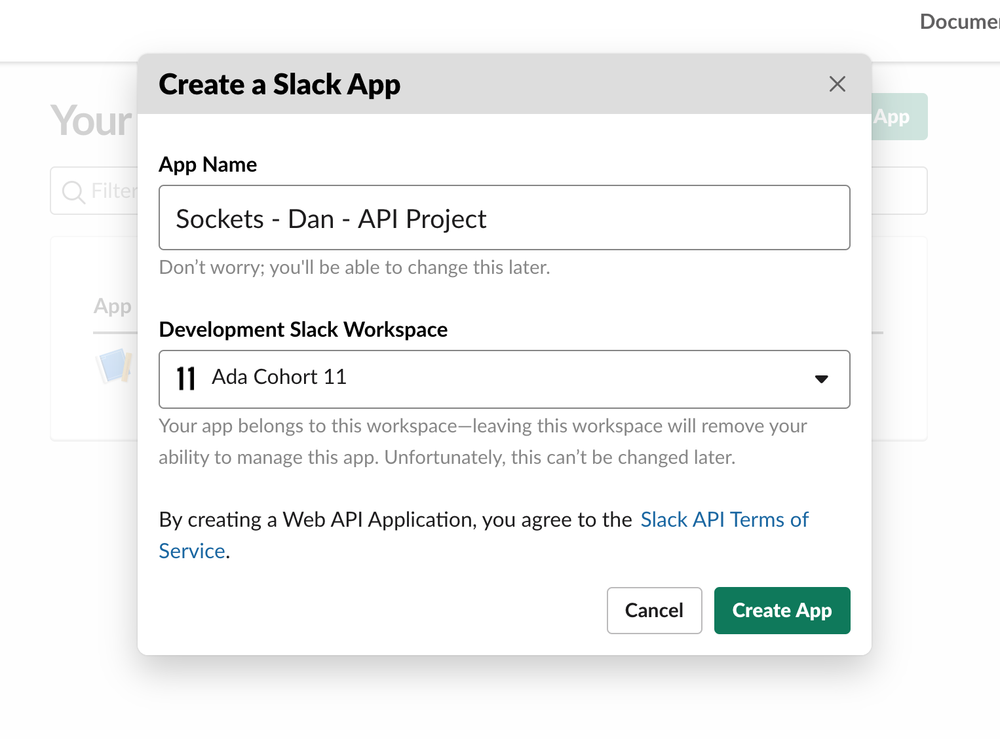
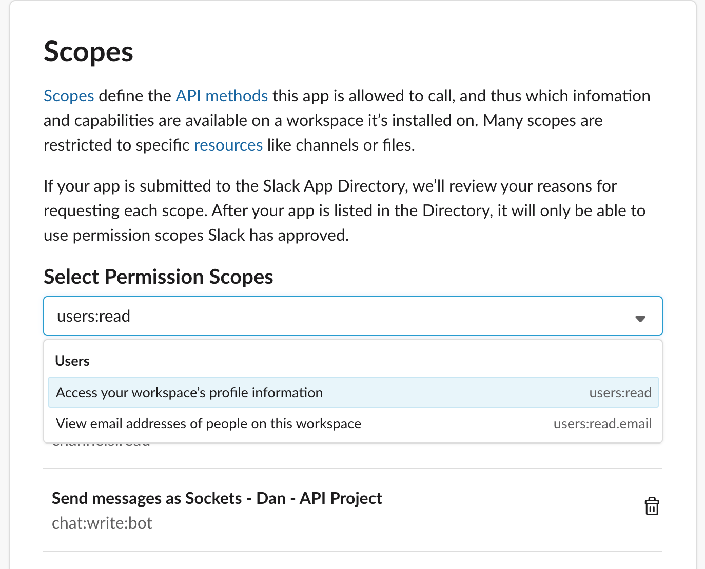
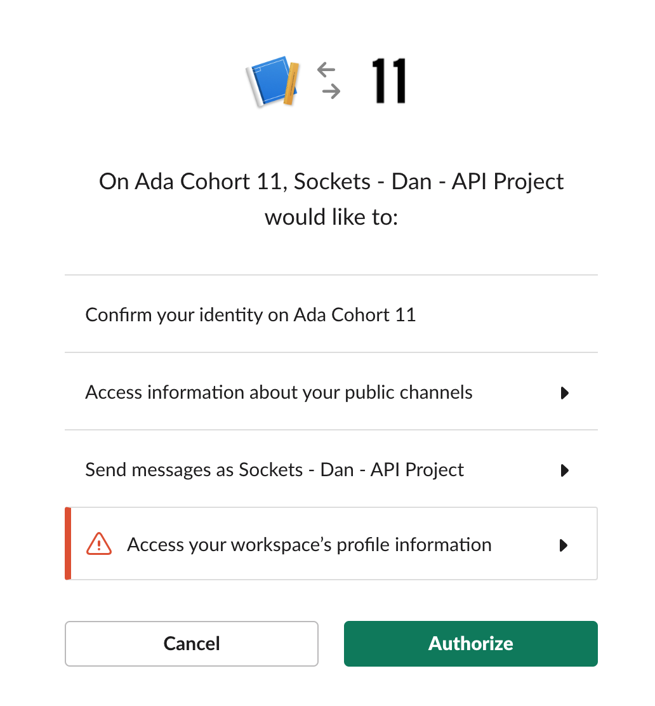
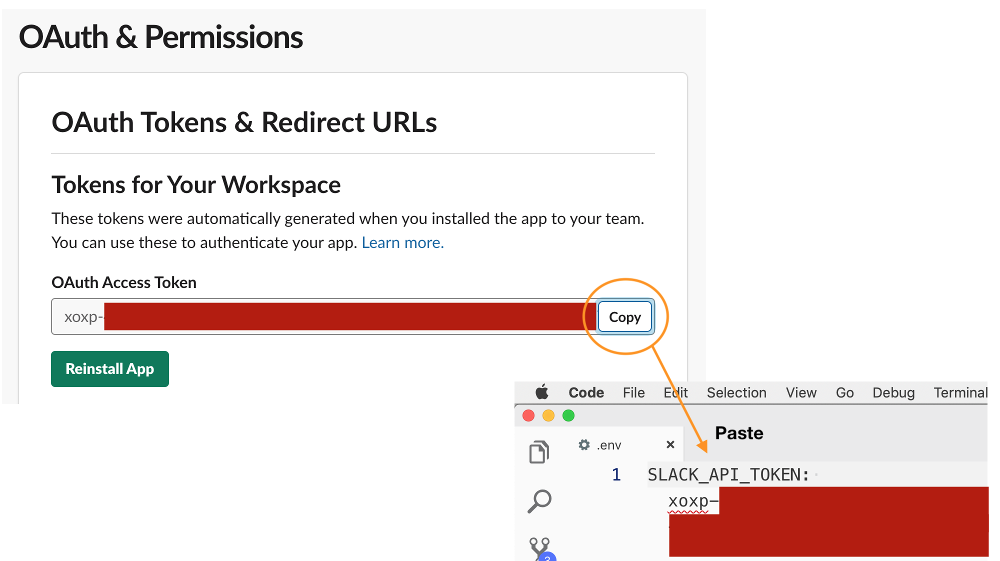

# slack.rb - A Slack Command Line App

## At a Glance

- Pair, [stage 2](https://github.com/Ada-Developers-Academy/pedagogy/blob/master/rule-of-three.md#stage-2) project
- Due EOD Friday, *DATE HERE*

## Introduction

To practice working with APIs, we will utilize the API for a tool with which you already very familiar: Slack!

The application we build this week will be designed for humans to use. This means the format will be familiar to us, but it seems a little silly - why would you use the command line when you could just use the app?

However, there are many places where you might want to use Slack, where it doesn't make sense to have a human in the loop. For example, you might set up a continuous integration tool like [Travis CI](https://travis-ci.org/) to run your tests automatically whenever you submit a pull request. Travis has the ability to post in your Slack channel when the tests are done, using the Slack API in a way similar to the way we will in this project.

## Learning Goals

- Sending requests to and receiving responses from an API
- Working with data from an external source
- Mocking an external dependency during testing
- Designing and implementing a program using inheritance

## Objective

We will write a complete command-line application that interacts with Slack. This application will be able to:
- List users and channels
- See details about a user or channel
- Send a message to a user or channel

## Getting Started

### Scaffolding

We have provided you with our standard Ruby project setup:
- `lib` and `specs` folders
  - `lib/slack.rb` is the Ruby file you should use to run the program. There's a bit of code here already - do some research and find out what it does!
  - `specs/test_helper.rb` setup to use minitest, simplecov and VCR
- A `Rakefile` and a `Guardfile`
- A `.gitignore` file

Other than this environment, there is no pre-built code for this project. All the project code and all the tests are up to you to create!

### Setup

This is a pair project, so you and your pair should:

1. High-five
1. Choose **one** person to fork this repository in GitHub
1. Add the person who **didn't** fork the repository as a [collaborator](https://help.github.com/articles/inviting-collaborators-to-a-personal-repository/).
1. Both individuals will clone the forked repo: `$ git clone [YOUR FORKED REPO URL]`

### Documentation

Since you'll be working with an external API, it will be good to have the documentation handy. The three endpoints this project will use are:
- [channels.list](https://api.slack.com/methods/channels.list)
- [users.list](https://api.slack.com/methods/users.list)
- [chat.postMessage](https://api.slack.com/methods/chat.postMessage)

## Setup Requirements

In order to interact with the Slack API, you will need to set up an _authentication token_. This token will not be shared, so **both partners must follow these steps**.

1. Go to https://api.slack.com/apps
    - You might have to sign in using your Slack credentials
1. Click the green `Create New App` button
1. Fill out the details in the modal window
    - For the name of your app use `ClassName - YourName - API Project`
    - For the workspace, use the Slack workspace for your cohort

    
    - Click the green `Create App` button
1. Click `Add features and functionality`, then `Permissions`
1. Scroll down to `Scopes`, and add the following three permissions:
    - `chat:write:bot`
    - `channels:read`
    - `users:read`

    
    - Click the green `Save Changes` button
1. Install and authorize the app:
    - Scroll to the top of the page and click the green `Install App to Workspace` button
    - Check that your app's permissions are correct and click the green `Authorize` button

    
1. You should now see an `OAuth Access Token`. Copy this and paste it into your app's `.env` file.
    
    - The `.env` file should already be in the provided `.gitignore`, but it doesn't hurt to double check!

Your application should now be able to access Slack!

### Verification

To verify that you've set up the Slack token correctly, work with your partner to write a script that does the following:

1. Use the `dotenv` gem to load environment variables
1. Use HTTParty to send a `GET` request to the [`channels.list` endpoint](https://api.slack.com/methods/channels.list)
1. Check that the request completed successfully, and print relevant information to the console if it didn't
1. Loop through the results and print out the name of each channel

If your tokens are set up correctly, each of you should be able to run this script.

## Implementation Requirements

We will do an in-class design activity for this project. While you should read through these requirements before that exercise, we do not recommend beginning work until we have finished classroom work.

### Testing

For this project, we have provided our standard test infrastructure:
- A `specs/` folder containing a `test_helper.rb` file, including
    - Minitest reporters
    - Simplecov
    - VCR
- A `Rakefile`, allowing you to run tests via `rake test`
- A `Guardfile`, allowing you to watch tests via `guard`

You do not need to test your main command loop, or the user interaction portions of your app. However, **all other classes and helper methods should be thoroughly tested**. Here are some tips:

- Follow TDD best practices (pseudocode, red, green, refactor)
- Add tests for all code you write
- Make sure all tests are green before pushing to GitHub
- Make sure all tests are green after you pull

### Wave 1 - Listing Channels and Users

As a user, when I launch this program... 

- I should see information about how many channels and users were loaded
- I should then be given three options for how to interact with the program:
  - `list users`
  - `list channels`
  - `quit`

As a user who is at the program's input prompt...

- When I type `list users`, I should see a list of all the users in the Slack workspace. This list should include username, real name, and Slack ID.
- When I type `list channels`, I should see a list of all the channels for that workspace. This list should include the channel's name, topic, member count, and Slack ID.
- When I type `quit`, the program should exit.
- After completing any command other than `quit`, the program should reprint the list of commands and ask for another input.

**Hint:** You may want to investigate the [Table Print gem](https://github.com/arches/table_print) to handle formatting tables.

### Wave 2 - Selecting and Showing Details

**Vocab:** channels and users are both _recipients_.

As a user at the input prompt...

- I should see three additional options:
  - `select user`: select a user as the current recipient
  - `select channel`: select a channel as the current recipient
  - `details`: show details on the current recipient
- When I type `select user`, I should be able to supply a username or Slack ID. The corresponding user should be the "selected" recipient.
- When I type `select channel`, I should be able to supply a channel name or Slack ID. The corresponding channel should be the "selected" recipient.
- For selecting both users and channels, if no user/channel has that name or ID, the program should let me know and return to the main command loop.
- When I type `details`, the program should print out details for the currently selected recipient. What information is printed depends on whether it's a channel or a user.
  - If no recipient is currently selected, the program should let me know and return to the main command prompt.

### Wave 3 - Sending Messages

As a user at the input prompt...

- I should see one additional option: `send message`.
- When I type `send message`, if a recipient is selected the program should ask me to type out a message, which will be sent to that recipient.
  - If no recipient is currently selected, the program should let me know and return to the main command prompt.

## Optional Enhancements

Don't even think about reading these until all the primary requirements are complete.

- As a user, I can change global settings for the program
  - These settings include the username for the bot and an emoji to use as an icon
  - When I change these settings, the program should save them in the JSON format in a file named `bot-settings.json`. When I restart the program, it should reload those settings.
- As a user, I can see a history of messages sent to the currently selected recipient. If I change recipients, the message list should also change.

If you're done with all that, read through the list of other endpoints for the Slack API, find one that does something interesting, and add it to your program!

## What Instructors Are Looking For
Check out the [feedback template](feedback.md) which lists the items instructors will be looking for as they evaluate your project.
