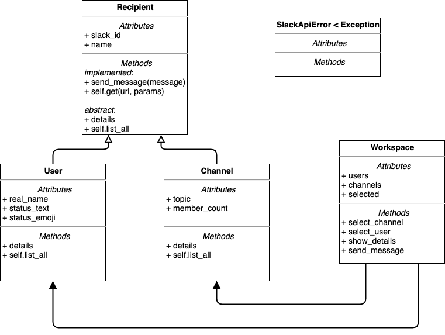

# Slack CLI Design Activity

In this exercise, you will work with your partner to come up with a design for the Slack API project. Once you have a design, we will provide our design, giving you a chance to compare and contrast the two.

While we encourage you to use the provided design for this project, there is much to be gained from going through the design process _before_ seeing our version.

## Learning Goals

- Practice the object-oriented design process
- Compare and contrast different designs for the same program
- Implement a program from a provided UML diagram

## Your Design

Read through the project requirements with your partner, then follow our standard [object-oriented design process](https://github.com/Ada-Developers-Academy/textbook-curriculum/blob/master/02-intermediate-ruby/oo-design.md).

- What are the nouns, and how are they composed into objects and relations?
- What are the verbs, and which verb belongs with which object?

Build a UML diagram with your partner.

## Instructor Design

Once you are happy with your design, click here to see the UML from the instructor implementation

Note that only public methods and attributes are shown.

<!-- https://www.draw.io/#G15pbTY4VOpswPf_TqNqy7ea-PYsPUmg6L -->

With your partner, answer the following questions about the instructor design:

- What _composition_ relations exist between objects in this design?
- What _inheritance_ relations exist between objects in this design?
- How are the objects and the relations between objects, different than the design you and your partner came up with?
    - Why do you imagine we did it this way?
    - What are the pros and cons of each approach?
- How are the methods and the placement of methods within objects different than the design you and your partner came up with?
    - Why do you imagine we did it this way?
    - What are the pros and cons of each approach?
- What surprised you about this design?
- What questions do you have about this design?
